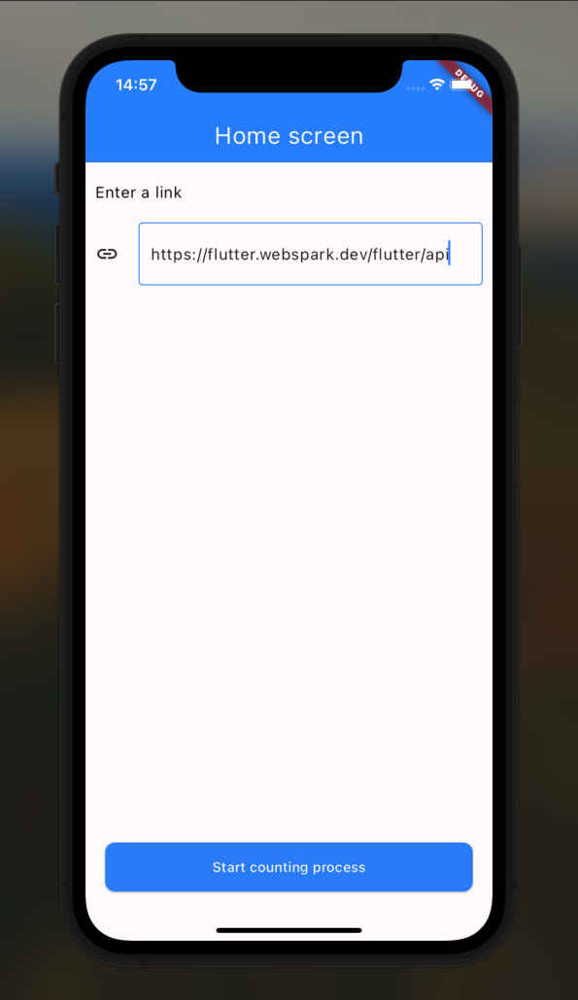
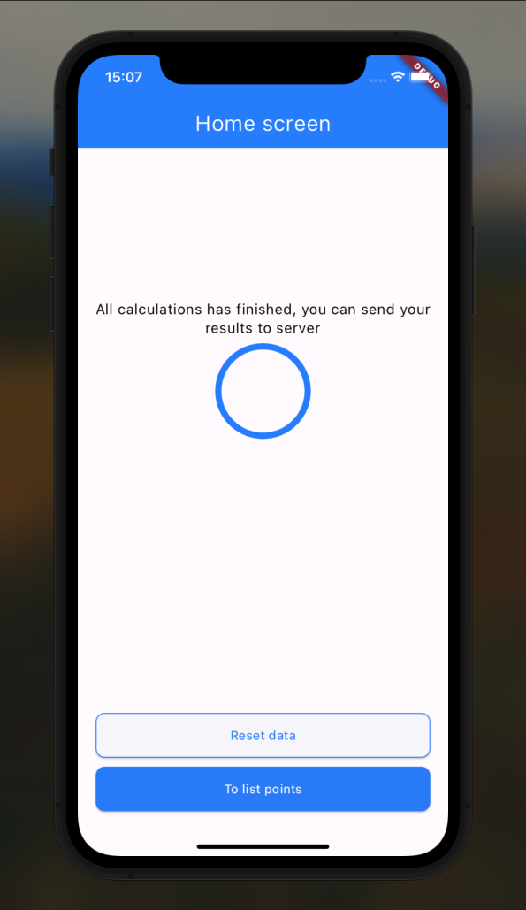
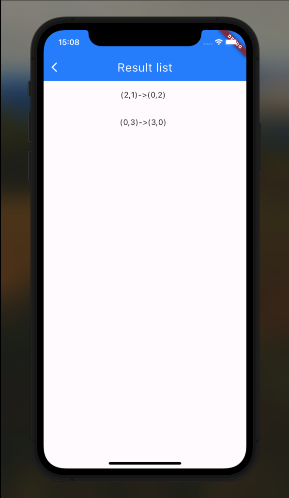
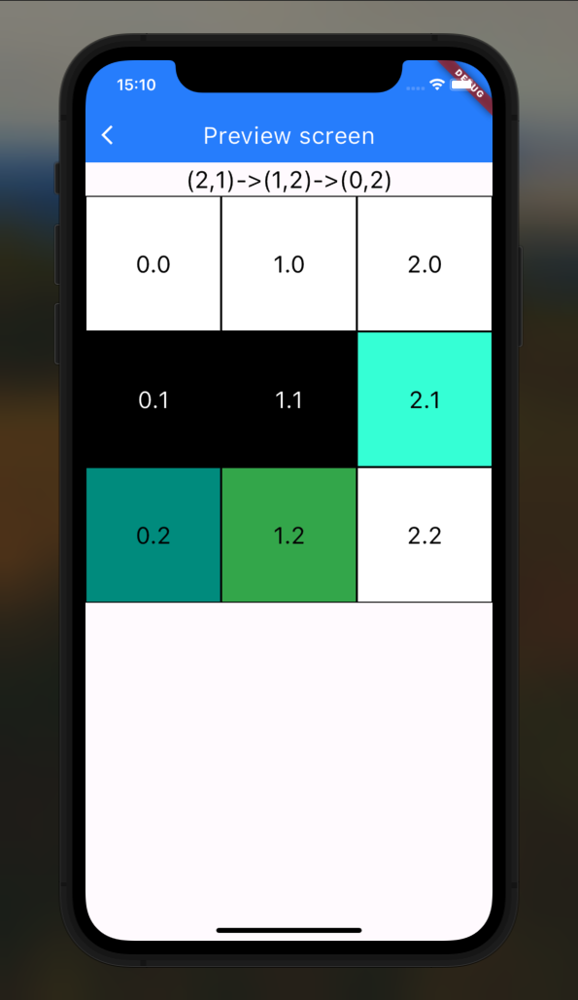
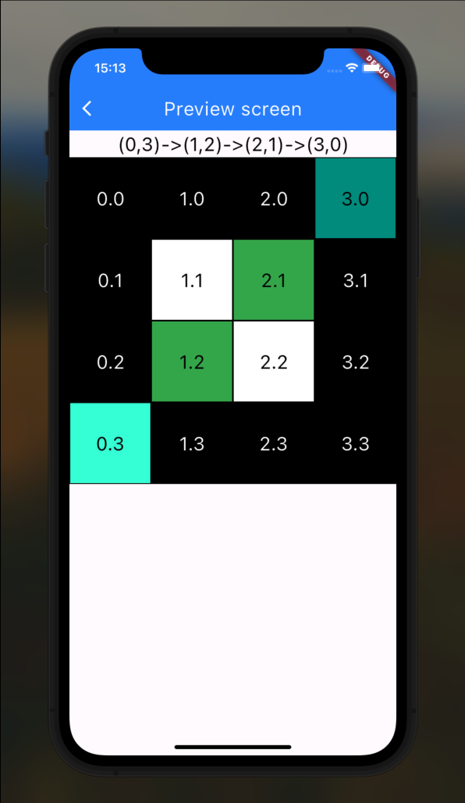

# Webspark

## Application for calculating the shortest path from point A to point B

Fisrt, we see home screen, where user needs to enter a link for receive a request with ponts.

After a success response, we can see next widgets:

Screen with points:

Result screen for calculate from 2.1 point to 0.2 point:

Result screen for calculate from 0.3 point to 3.0 point:

Explanation colors:

- Black cards are forbidden
- White cards - allowed, but do not participate in the search
- Light green card - starting point
- Dark green card - end point
- Green cards - participate in the search
